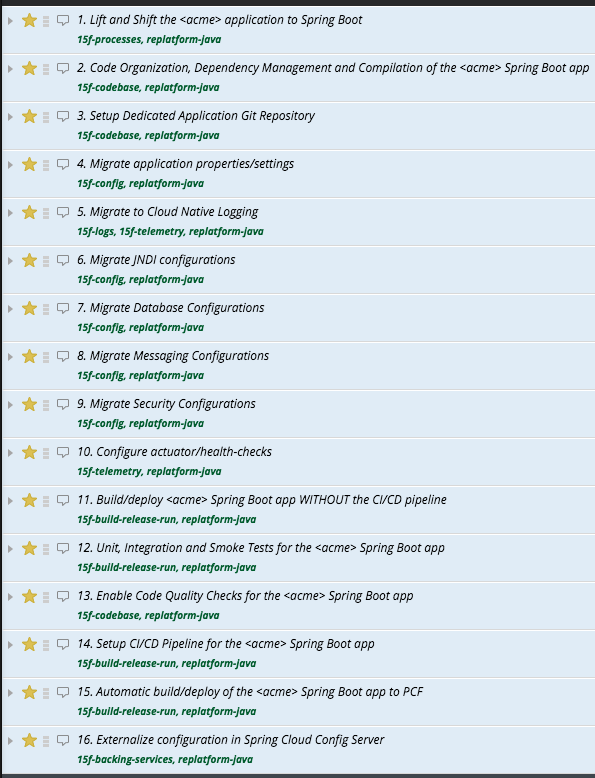

# AppTx-tracker-templates
**Pivotal Tracker Project templates** for AppTx ***replatform*** and ***modernization***.

The _templates_ in this repo can be used to create a tracker project with a common set of user stories with well-defined acceptance criteria for the AppTx _replatform_ and _modernization_ efforts and, helps to reduce time/effort to create trackers during customer engagements.

The template file is _imported_ into the Pivotal Tracker to create a project for _each_ application _replatform_ or _modernization_ effort in an AppTx engagement.

## Author
**Prashanth Belathur** - pbelathur@pivotal.io

## Replatform tracker templates
- [Java](https://github.com/pivotalservices/AppTx-tracker-templates/blob/master/apptx_replatform_tracker_template_java.csv)
- [.NET](https://github.com/pivotalservices/AppTx-tracker-templates/blob/master/apptx_replatform_tracker_template_dotnet.csv)

## Modernization tracker templates
- [Java](https://github.com/pivotalservices/AppTx-tracker-templates/blob/master/apptx_modernization_tracker_template_java.csv)
- .NET

## Notes:
- The `<acme>` placeholder in the template file should be replaced with the _actual_ application name _before_ importing the template into the Pivotal Tracker to create a new Tracker project.
- The _number_ in the User Story title indicates the _order/sequence_ of stories in a project.
- Each story is also _tagged_ with a ***12 Factor category***.

## Acknowledgments
- Rohit Kelapure
- Matt Campbell
- Alfus Jaganathan
